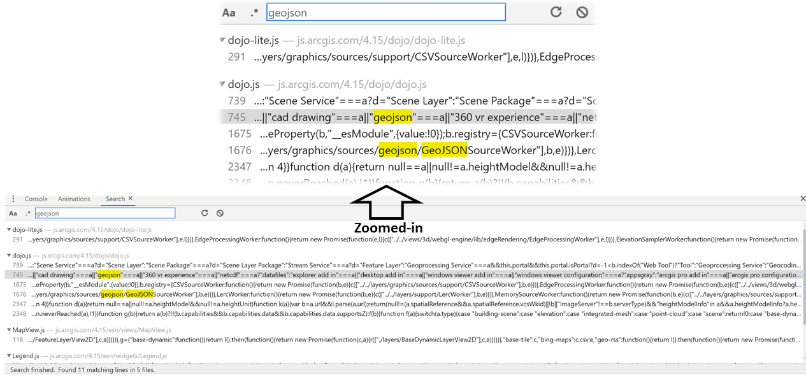
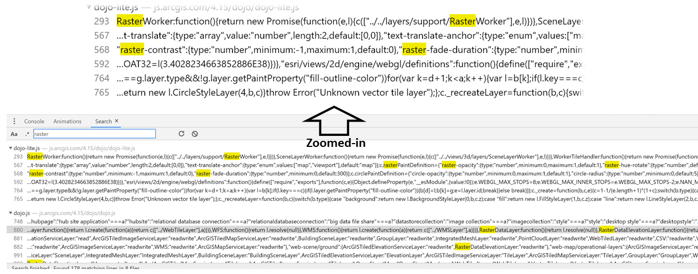
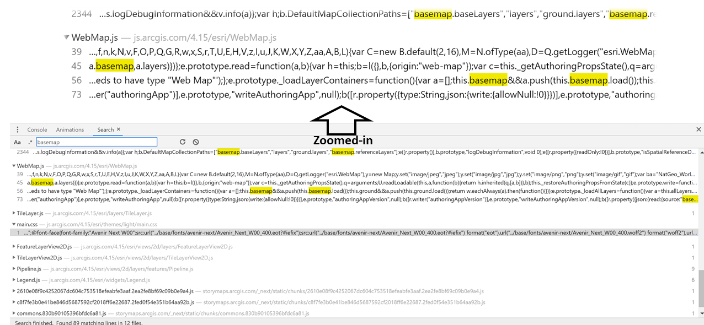

# essay

 <br>
 <br>
## Digital Geography for the Natural Heritage Conservation Mobilization in the U.S.<br>

### :newspaper: Introduction
#### A. Digital Geography<br>
Digital technology has long contributed in explaining phenomena that relate with almost all aspects of our contemporary world. The relationship between digital technology and geography took 3 forms:
- **produced through**, meaning that digital technology is aimed at actualizing unorthodox understanding to produce geographic, politics, and spatial knowledges. The engagement between the digital technology and geography has evidenced to be able to mobilize people power for social change;
- **produced by**, meaning that digital system served cities planning, management, governance, and research by integrating  urban big data, computational modelling, urban simulation, and interactions with diffent users and urban spaces;
- **geographies of digital**, meaning that the digital geographies are sets of technologies that go beyond an engagement with an interface, but with spatial big data. One of the examples is the  geotagged data retrieved from Twitter that can be used to explain sociospatial dynamics in particular area to public (James, Kitchin and Leszczynski 2018, 26-34).<br>

> With this understanding, the web map entitled [America's Public Land Giveaway](https://storymaps.arcgis.com/stories/36d517f10bb0424493e88e3d22199bb3) written by [Andre Miller](https://medium.com/westwise/americas-public-lands-giveaway-6bf395d759c0) is selected for this essay. The web map provides a good example of how the integration between a story map and digital geography could increase its potentials in mobilizing civis power through rich and  evidence-based narrative. <br>

#### B. Web Map<br>
The **`goal`** of the web map is *to discuss the implications of the unreformed U.S. government's lands leasing policy on natural heritage conservation efforts in the Western part of the U.S*. These natural heritage include **Dinosaur National Monument** and **critical habitats of plant and animal species** situated in 10 states: Arizona, California, Colorado, Idaho, Montana, New Mexico, Nevada, Oregon, Utah, and Wyoming. The issues revolve around:
- un-updated leasing system for oil and gas industries' operations in the West which then, allows private companies to take this advantage.
- inproportionate composition between oil and gas industries uses and public uses where **90% of the land is dedicated for these industries** and **only 10% is left for recreational and conservation purposes**.
- the Trump administration's initiative of **offering 24.5 million of acres of land nationwide for these industries**, hence, only about 13.5 millions of acres will be aimed for public use and conservation.
- the land price must be paid by the private companies which is **below the market price**. <br>

Despite the leasing system has not yet been renewed by Congress, it has **already locked up millions of acres of public land in these states for these industries**. Based on the two organizations' studies, many oil and gas industries produced only limited amount of these energy resources.<br>

 <br>

>The image shows the border between Colorado and Utah where oil and gas development interrupts and  dinosaur fossils lie within the rocks.<br>

The **`developer`** of the web map is [Andre Miller](https://medium.com/westwise/americas-public-lands-giveaway-6bf395d759c0) who is affiliated to a nonpartisan conservation and advocacy organization for the American West, the [Center for Western Priorities](https://westernpriorities.org/about/) and collaborates with a non-profit organization for wildlife conservation, the [Wilderness Society](https://www.wilderness.org/about-us).<br>

The major functions of the web map is to **convince public about negative implications of un-reformed oil and gas leasing system in the U.S. on the sustainability of natural heritage in those 10 states.** The web developer argues that ineffective leased lands could actually be utilized for social and conservation-related uses. <br>

The **`target`** of this web map is all types of users or public audience. It serves to allow all types of users to recognize how invisible [panopticon](https://www.theguardian.com/technology/2015/jul/23/panopticon-digital-surveillance-jeremy-bentham) along with its machine exercised power in the U.S. (Foucault 2014, 660). It is expected that this research-based narrative could develop public awareness on the issue and mobilize them to encourage Congress and the U.S. government to reform the land leasing policy in the West.<br>

### :bar_chart: Systematic Architecture
To create, serve, and use a web mapping,  different types machines are required. These machines represent separate levels or tiers of architecture. The figure below shows the *Web Client Application* which extends into *External Internet* and then, systematically continues to *Internal Network*, *Web-server* and *Geospatial server*. The line then branches to 2 systems: *File Server* and *Database server*. In the left part of the diagram is another computer drawing called as *Administrators* and *Internal Client Application*.<br>

 <br>

Related to this web map, the systematic architecture can be explained as follows:
- *desktop workstations* are used by the web's administrators and internal client applications to prepare data, author maps, including administer the other machines.
- *database server* and *file server* serve as what hold the GIS data and research data of the two organizations. The data might consist of spatial data in raster or vector formats.
- *geospatial server* used to host the web services in this project is ArcGIS supported by ESRI. [Esri Geoportal Server](https://www.esri.com/en-us/arcgis/products/geoportal-server/overview) is an open source product that since 1969 has contributed in enabling a lot of organizations to manage and publish their geospatial data and resources for public consumptions.<br>

### :lock_with_ink_pen: Code Analysis
In this part, I will discuss important elements and codes of the web, the types of data that flow between client and server, web's major libraries and web's codes that support its responsiveness.
#### A. Elements and Codes<br>
There are four important elements that I identified from this web map.<br>
*First*, to enable client to track any applications that supports JavaScript, the web developer used the following element: <br>

```
var _paq = _paq || [];
  /* tracker methods like "setCustomDimension" should be called before "trackPageView" */
  _paq.push(['trackPageView']);
  _paq.push(['enableLinkTracking']);
  _paq.push(['trackAllContentImpressions']);
  (function() {
    var u="https://storymaps-analytics.arcgis.com/";
    _paq.push(['setTrackerUrl', u+'analytics.php']);
    _paq.push(['setSiteId', '7']);
    var d=document, g=d.createElement('script'), s=d.getElementsByTagName('script')[0];
    g.type='text/javascript'; g.async=true; g.defer=true; g.src=u+'analytics.js'; s.parentNode.insertBefore(g,s);
  })();
```
<br>

*Second*, to scale the SVG (Scalable Vector Graphics) in which developers can set its coordinates, width and height, the web developer used the element:
<br>
```
<svg viewBox="0 0 32 32" class="jsx-2552718285">
<path d="M16.707 16l10.607 10.606-.708.707L16 16.707 5.394 27.313l-.708-.707L15.293 16 4.686 5.394l.708-.707L16 15.293 26.606 4.687l.708.707z" class="jsx-2552718285">
</path>
</svg>
```
<br>

*Third*, to match the web map to other widget or small gadgets, the web developer used th element:
<br>
```
div class="esri-widget--button esri-widget esri-interactive"
```
<br>

*Fourth*, to allow users to zoom in and out within a view, the web developer used the following element from Esri:
<br>
```
<div class="esri-widget--button esri-widget esri-interactive" role="button" tabindex="0" title="Zoom in">
```
<br>

#### B. Data Flows Between Client and Server<br>
The data used by the wed developer come from the two nonprofit organizations' studies and other resources which are linked to the web. These data include:<br>
- the *Federal Onshore Oil and Gas Leasing Reform Act of 1987 100th Congress (1987-1988)* <https://www.congress.gov/bill/100th-congress/house-bill/2851> to support the author's argument that the leasing system on land for oil and gas drilling was very outdated.<br>

- the *spatial distribution of federal oil and gas leases* comprising of those leased for minimum bid ($2 per acre), those leased noncompetitively (below $2 per acre), and leased under Trump administration.

<br>

- the *spatial distribution of natural heritae sites*: national parks, monuments, conservation areas, wilderness areas, prioritized sage-grouse habitat, and mule deer migration corridor<br>

<br>

- the *spatial conflict* between the industries' exploration sites and the mule deer migration corridor<br>

<br>

#### C. Libraries<br>
Libraries used in this web map includes **css**, **js**, **jquery**, and **analytics.js**. Libraries in web-based javascript is used to provide various functions related to events or AJAX, and thus, allow web map's developers to perform a task. The major libraries used by the web map's developer can be seen from the table below.

| Library                                                 | Descriptions           | Function |
| ------------------------------------------------------- | ---------------------- | -------- |
| [CSS](https://developer.mozilla.org/en-US/docs/Web/CSS) | Cascading Style Sheets |language that describes the style of an HTML document and how its elements should be displayed |
| [JS](https://www.javascript.com/)                       | JavaScript             |the programming language of HTML and the Web |
| [JQuery](https://jquery.com/)                           | JQuery                 |handle browser incompatibilities and to simplify HTML DOM manipulation, event handling, animations, and ajax|
| [Analytic](https://developers.google.com/analytics/devguides/collection/analyticsjs) | Analytic.js |measure the frequency of users in interacting with HTML-based map|

<br>
The *analytics.js* library has the same function as *Google Analytics* and is classified as a JavaScript library. Its specific function is to measure the frequency of users in interacting with the web map. The script tag with embedded **`analytics.js`** used by the web map's developer can be seen below:
<br>
```
script type="text/javascript" async="" defer="" src="https://storymaps-analytics.arcgis.com/analytics.js"
```
<br>

#### D. Responsive Design<br>
A good interactive web map should be responsive to different needs, users and settings. **Responsive design** is as a set of strategies for using the Open Web Platform that dynamically change the content, layout, and styling of a webpage based on the display device and user context. The examined web map is a responsive web map design  because it uses **meta tags** and **div tags** elements. The following are the elements used by this web map's developers.<br>

The following meta tag tells the browser what **width it should render the viewport** (*adaptive cartography*)
<br>

```
meta name="viewport" content="width=device-width,minimum-scale=1,initial-scale=1"
```
<br>

With meta tag, the web map designs will **change/adapt based on different use and contexts** including the computing system held in hand, such as a smartphone or tablet (*mobile device*). The meta element used by the web map's developer for this function is:
<br>

```
meta name="mobile-web-app-capable" content="yes"
```
<br>

The following div tag **interlocks set of horizontal rows and vertical columns in a webpage responsively** with size based on relative percentage (*fluid grid*).
<br>

```
div class="page-container"
```
<br>

The following div tag **adds a full width containers (which spans 100% of window) inside a container** which has a fixed width and aligned center. The element used for this function is:
<br>

```
div class="container full-screen main"
```
<br>

### :books: Data Sources
#### A. Data Types<br>
There are two major types of data used by the web developer: vector and raster. In terms of **vector**, the polygons in the maps indicate the different size of land parcel with different land leases. <br>

| Data type  |Format      | Descriptions |
| ------------------- | ----------------------- | ----------- |
| *geojson*  | vector | polygons that represent land lots/parcels|
| *tilelayer* | raster | land contours of the 10 states in the U.S.|

One of the codes associated with the GeoJson files can be seen from the following screenshot.<br><br>

The **raster** data is displayed through tilelayer that shows the different elevation of land in the 10 states in the U.S. The screenshot below shows the code associated with the raster.<br><br>

#### B. Critiques on the UI/UX<br>
The **`User Interface`** and **`User Experience`** Designs are two crucial components of a web map which work closely together. Despite their similar roles, each component has different design and process. The User Experience (UX) relates with elements that are used to effectively influence users' experience, perceptions, and easiness in accessing the web map. The UI design  focuses on the appearance, presentation, and interactivity of the web map with user. This web map's developers have integrated **`storymap with digital geography`** by thoughfully considering the kinds of experience that can be obtained by users while accessing their web map. These experiences include:<br>

- expanding the thematic map by clicking the icon at the top-right and the legend at the left-bottom of the page. This makes users easily interact with the map. Clicking the expland icon again will bring the users to the original scale of map.<br><br>
- capturing the developers' emphasis after experiencing the **animated zoom** of the map as provided in the page of National Dinosaur Monument.<br><br>
- zooming in and zooming out the map with accordance to their needs<br><br>
- choosing which page to revisit from the list provided in the left pane<br><br>
- obtaining more detail of data of each state by clicking specific area of the map.<br><br>
- viewing a highlighted area of concern in the map and quickly obtain detailed data features of the area. Users can also zoom in the map or go to next page of data box.<br><br>

### :page_with_curl: Descriptions of Web Map Elements<br>
The basemap used in this project is attributed to those provided by **`Esri Gallery`**. The script tag the web developers used for this is:
<br>
```
<script type="text/javascript" charset="utf-8" src="https://js.arcgis.com/4.15/esri/layers/TileLayer.js">
```
<br>

<br>

### C. Maps and Tile Layers<br>
There are **five thematic maps** used in this web map :
1. types of federal and oil gas leases map (minimum bids, noncompetitively bids, under Trump administration)
2. dinosaur national monument map
3. priority sage-grouse habitat map
4. red-desert to hoback migration map in Southern Wyoming/mule deer migration corridor
5. federal oil and gas leases still available to buy noncompetitively.<br>

The web developer used basemap tile and layers from ESRI. The scrip tag used by the developers is:
<br>
```
<script type="text/javascript" charset="utf-8" src="https://js.arcgis.com/4.15/esri/layers/TileLayer.js"
```
<br>

The **`interactive elements`** used by the web map's developers include:
1. Interactive Map View
- the controlable zoom-in and zoom-out
- the GeoJson event where a layer will appear on certain pages, overlaying the visited page/map. For instance, when we scroll down the Dinosaur National Monument page, the federal oil and gas leased lands will appear and overlay the existing map of the Dinosaur National Monument map.
- the map will be enlarged as user click the expand icon on the top-right of the page/map<br>
2. Interactive Legend
- the legend will appear as user click the legend icon on the bottom-left of the page/map. <br>
Besides these two interactive elements, the other element is **interactive home icon**. It enables users to return to the first page of the web. The web developer does not use scale and compas which indicate the weaknesses of this web map.<br>

### :bulb: Strengths & Weaknesses
#### A. Strengths
The strengths of the web map that I identified are:
- the web map provides an example of **a responsive designed web map**. It is adaptive to different needs or types of users, allows users to expand the map and legend, and mobile-device friendly.
- it has interactive elements that are **relatively easy to navigate** and allow users not only to explore the map but also to obtain **details of the spatial the data** used by the developer. Users can also explore the page **without being overwhelmed** with too many options.
- it gives a **suprise effect** as users navigate the *Dinosaur National Monument* page where the map automatically zooms-in. The developer bring users to the focus on the issue by also automatically zooming in the federal oil and gas leased lands that are conflicted with the heritage site.<br>

#### B. Weaknesses
The weaknesses of the web map are:<br>
- since each layer contains numerous amount of data featurs of 10 states, some **layers** in the page of **mule migration corridor** for instance, has a very **slow processing to be completely uploaded**. This consequently requires users to have a strong network connection and high-hardware specifications with better graphic card (Roth et al. 2018).
- some data are better displayed with **real time visualization** so it can convey the change of the spatial structure of the leased land from 1897 to the current time. The real-time data visualization has widely been used to perform real-time monitoring of critical city infrastructure and to increase transparency (Goodchild (2010) and Hudson-Smith,Batty (2014) mentioned in Li, et al., 2019, pp. 3-10).

<br>

### :thought_balloon: Discussion<br>
The web map represents an effective use of digital geography in producing a spatial knowledge in an emotional and reflexive ways (James, et al., 2018, p. 28). **Emotional** means it develops concerns and sympathy of the users participate in solving  related to the issue. **Reflexive** means that it encourages users to reflect the conflict and mobilize to change the undesired condition resulted from unreformed lands leasing system in the U.S..<br> Despite the effectiveness of social media in mobilizing people is highly dependent upon a lot of factors (e.g., political system of the country, government's control, literacies, internet access) (Kay, et al., 2020, p. 355), the **data crawling technique** from social media such as Twitter might be useful to inform users about public perceptions on this spatial conflict. <br>

Using a form of a story map, the web map effectively communicates its goal. The 3 narrative elements of this web map include:
<br>
1. **Set-up Act**<br>
The **settings** are the leased lands for oil and gas drilling in ten states in the U.S.: Arizona, California, Colorado, Idaho, Montana, New Mexico, Nevada, Oregon, Utah, and Wyoming. The **key characters** are the Trump administrators, Congress who still unreformed the leasing system policy, and the conservationists who defend the public rights over the needs of recreations and conservations. The **problem** is  the conflict between the U.S. government and conservationists, between the land commercialization/industrialization and natural heritage conservation. The **time** is framed within the Trump's administrative.<br>
2. **Conflict Act**<br>
The **key issue** of the story is the conflict between the U.S. government and conservationists who are compelled to protect the natural heritage conservation in the ten states in the face of unrealistic land leasing system of the U.S. Unlike a common narrative or drama, this researh-based story map is built gradually from introducing the conflict to the recommendation for future spatial planniang and policy making.<br>
3. **Resolution Act**<br>
The **recommendations/solutions** are assessing the land's suitability for oil and gas leasing through comprehensive planning processes, engaging community in the planning, raising the national minimum bid from $2.00 per acre to at least $10.00 per acre, and setting up a reliable evaluation to evaluate the lessees' capacity of exploring and producing oil and gas <br>

### :flags: Credits/Acknowledgement
The credits for this project go to:
- [Andre Miller](https://medium.com/westwise/americas-public-lands-giveaway-6bf395d759c0)
- [Center for Western Priorities](https://westernpriorities.org/about/)
- [The Wilderness Society](https://www.wilderness.org/about-us).
- [Esri Geoportal Server](https://www.esri.com/en-us/arcgis/products/geoportal-server/overview)
- Professor Bo Zhao, the instructor of the GEOG 458 for providing the lectures and materials to analyze the web map.<br>

### :link: References
[1] Andre Miller:  <https://storymaps.arcgis.com/stories/36d517f10bb0424493e88e3d22199bb3><br>
[2] James, A., Kitchin , R. & Leszczynski , A., 2018. Digital turn, digital geographies?. Progress in Human Geography, 42(1), p. 25–43.<br>
[3] Kay, S., Zhao, B. & Sui, D., 2020. Can Social Media Clear the Air? A Case Study of the Air Pollution Problem in Chinese Cities. The Professional Geographer, 67(3), pp. 351-363.<br>
[4] Kitchina, R., Maalsen, S. & McArdle, G., 2016. The praxis and politics of building urban dashboard. Geouforum, Volume 77, pp. 93-101.<br>
[5] Li, W., Batty, M. & Goodchild, M. F., 2019. Real-time GIS for smart cities. International Journal of Geographical Information Science, pp. 1-14.<br>
[6] Song, Z., 2017. Map-Based Visual StoryTelling: As Assessment of Emerging Genres and Tropes. Madison: University of Wisconsin.<br>
[7] Zhao, B., 2020. Geospatial Data for Digital Geographies; System Architecture for Web Mapping; Web Programming Basics I: HTML and CSS, Seattle: University of Washington.<br>
[8] Markdown-Guide https://about.gitlab.com/handbook/markdown-guide/#puzzle<br>

Link here for accessing the web map: <https://storymaps.arcgis.com/stories/36d517f10bb0424493e88e3d22199bb3>
