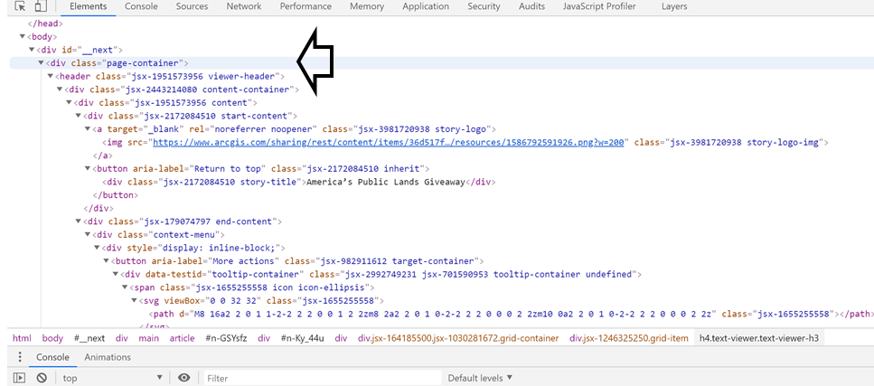

# essay

 <br>
 <br>
## Digital Geography for Natural Heritage Conservation Mobilization in the U.S.<br>

### :newspaper: Introduction
### A. Digital Geography<br>
Digital technology has long enabled scholars to explain phenomena related to almost all aspects of urban living: politics, social, culture, economy, and nature. The relationship between the digital technology and geography takes at least 3 forms:
- **produced through**, meaning that the digital technology is aimed at actualizing unorthodox understanding to produce geographic, politics, and spatial knowledges. Despite criticsm against its use, the engagement between the digital technology and geography has proven to be able to mobilize people power for social change;
- **produced by**, meaning that digital system served cities planning, management, governance, and research by integrating the urban big data, computational modelling, urban simulation, and interactions with diffent users and urban spaces;
- **geographies of digital**, meaning that the digital geographies are sets of technologies that go beyond an engagement with an interface, but with spatial big data. One of the examples is the  geotagged data retrieved from Twitter that can be used to explain sociospatial dynamics in particular area to public (James, Kitchin and Leszczynski 2018, 26-34).<br>

> With this understanding, the web map entitled **`America's Public Land Giveaway`** written by *Andre Miller* is selected for this essay. The web map provides a good example of how the author carefully designed and selected interactive elements that is integrated to a ctorymap style. It convinces public in a persuasive way about the implications of the U.S. government's unreformed land leasing system in the Western part of this country and hope of mobilizing civic power for the land leasing system reformation and natural heritage conservation.<br>

### B. Case Study<br>
The **`goal`** of the web map is *to discuss the implications of the U.S. government's policy of leasing millions of acres of public lands for private oil and gas development with low and outdated rent price and its impacts on the natural heritage conservation efforts in the Western part of the U.S*. These natural heritage include **Dinosaur National Monument** and critical habitats of plant and animal species situated in 10 states: Arizona, California, Colorado, Idaho, Montana, New Mexico, Nevada, Oregon, Utah, and Wyoming. The issues revolve around:
- un-updated leasing system for oil and gas industries' operations in the West and private companies' actions of taking advantages from this.
- inproportionate composition between oil and gas industries uses and public uses in land use where 90% of the land is dedicated for the industries and only 10% is for recreational and conservation purposes.
- the Trump administration of offering 24.5 million acres nationwide for these industries, hence,more than 13.5 millions acres for public uses. <br>

It should be noted that these private companies **pay for the lands below the market price** and leave much of idle leased acres off limits to other uses. <br>

 <br>

Surprisingly, despite the leasing system has not been renewed by Congress, it has already locked up millions of acres of public land in these states. The disadvantages resulted from this are ineffective use of the lands. Based on their studies, many oil and gas industries produced only limited amount of these energy resources.<br>

The **`major functions`** of the web map is to **express geographic dimension of human experience in natural heritage conservation in the Western part of the U.S**. In long turn, the web map has potential to mobilize public to encourage the congress to modernize the oil and gas leasing system in these areas. Thus, the ineffective leased lands could be utilized for more proper functions: improving the life quality of societies and the protected animals and plants in the natural heritage sites. <br>

The web map does not limit its audience to particular groups, rather to the public audience. It is expected that the story could develop public awareness on the issue and mobilize them to encourage Congress and the U.S. government to revise the land leasing system and land utilization in the West.<br>

The web map serves as an interactive display of geographic information that not only tells social story but also answers users' questions regarding data related to this issue. This web map is designed by considering **interactive display** and allows people to reflect how the invisible **`panopticon`** <href="https://www.theguardian.com/technology/2015/jul/23/panopticon-digital-surveillance-jeremy-bentham"> along with its machine exercises power in the U.S.(Foucault 2014, 660).<br>

The developers of the web map are a non-profit organization for wildlife conservation, **`The Wilderness Society`** <https://www.wilderness.org/about-us> and a nonpartisan conservation and advocacy organization for the American West, **`Center for Western Priorities`** <https://westernpriorities.org/about/>.<br>

### :bar_chart: Systematic Architecture
In order to create, serve, and use web mapping, several different machines are required. The machines are often depicted in a diagram consisting of separate levels, or tiers of architecture. The figure below shows the **`Web Client Application`** which extends into **`External Internet`** and then, systematically continues to **`Internal Network`**, **`Web-server`** and **`Geospatial server`**. The line then branches to 2 systems: **`File Server`** and **`Database server`**. In the left part of the diagram is another computer drawing called as **`Administrators`** and **`Internal Client Application`**.<br>

 <br>

The systematic architecture of the web map is explained as follows:
- *desktop workstations* are used by the web's administrators and internal client applications to prepare data, author maps, including administer the other machines.
- *database server* and *file server* act as what hold the GIS data and research data of the two organizations. The data might consist of spatial data in raster or vector formats.
- *geospatial server* used to host the web services in this project is that provided by ArcGIS <https://www.esri.com/en-us/arcgis/products/geoportal-server/overview>. Esri Geoportal Server is known as an open source product that since 1969 has contrbuted in enabling many organizations like the two nonprofit conservation organizations to manage and publish their geospatial data and resources for wide range of users.<br>

<br>

As can be seen from the footnote of the web map, it was powered by **`ArcGIS`** provided by ESRI geoportal server.

### :lock_with_ink_pen: Code Analysis
To investigate the codes employed by the web map, I inspected the web map by right-clicking the web browser. The screenshots below show some important elements and codes of the web, the data flowed between the client and server, the web's major libraries and codes that specifically evidence its responsiveness.<br>

<br>

First, to enable client to track any applications that supports JavaScript, the code the developers used is: <br>

```
**var _paq = _paq || []**
```
{: .language-ruby}

Second, the code for scaling the SVG (Scalable Vector Graphics) which means it will allow us to set the coordinates as well as width and height
-  **svg viewBox="" class=""**
-  to scale the SVG element that we can set the coordinates as well as width and height
-  **div class="esri-widget--button esri-widget esri-interactive"**
-  to match to other widget or small gadgets.
-  **g transform='matrix()'**
-  to establish a new coordinate system inside the element where the transformations apply to. This means that the units specified for the element and its children might not follow the 1:1 pixel mapping, but are also distorted and scaled according to the transformation.
-  **figure class =''**
-  to display a piece of content, generally images with an optional caption.

### A. Data Flows Between Client and Server
The data flowed between the client and server come not only from the two nonprofit organizations' in-depth studies, but also information from other resources which are linked to the web. The data obtained from the web map include:
- the *Federal Onshore Oil and Gas Leasing Reform Act of 1987 100th Congress (1987-1988)* <https://www.congress.gov/bill/100th-congress/house-bill/2851>, which is used to support the author's argument that the leasing system on land for oil and gas drilling was very outdated.<br><br>
- the spatial distribution of federal oil and gas leases comprising of those leased for minimum bid ($2 per acre), those leased noncompetitively (below $2 per acre), and leased under Trump administration<br><br>
- the spatial distribution of national parks, monuments, conservation areas, and wilderness areas, including the prioritized sage-grouse habitat, and mule deer migration corridor<br><br>
- the spatial conflict between the industries' exploration sites and the mule deer migration corridor<br><br>

### B. Libraries
Libraries in web-based javascript is used to provide various functions, whether the matter is related to events or effects or AJAX, and allows map developers to perform a task. The major libraries used by this web map developer along with their functions is **`analytics.js`** library. The script tag for this is **script type="text/javascript" async="" defer="" src="https://storymaps-analytics.arcgis.com/analytics.js"** <br>. The **`analytics.js`** library has the same function as **`Google Analytics`**, and is classified as a JavaScript library that is utilized to measure how users interact with the web map.

A good interactive web map should be responsive to different users and settings. Responsive design is defined as a set of strategies for using the Open Web Platform that dynamically change the content, layout, and styling of a webpage based on the display device and user context. Inspecting the web's codes, the examined project is a responsive web map design particularly because it uses the following:<br>
- **`META TAGS`**
- The meta tag tells the browser what width it should render the viewport at (*adaptive cartography*)<br> with code: **meta name="viewport" content="width=device-width,minimum-scale=1,initial-scale=1"**.<br><br>.
- With meta tag, the web map designs will change/adapt based on different use and user contexts, and the computing system could be held in hand, such as a smartphone or tablet (*mobile device*) with code **meta name="mobile-web-app-capable" content="yes"**.<br><br>.
- **`DIV TAGS`**:
- The div tag interlocks set of horizontal rows and vertical columns in a webpage responsively with size based on relative percentage (*fluid grid*) with code: **div class="page-container"**.<br><br>
- The div tag adds a full width containers (which spans 100% of window) inside a container which has a fixed width and aligned center.<br>The code used by the web map is: **div class="container full-screen main"**.<br><br>

### :books: Data Sources
#### A. Data Types
There are two major types of data used by the web developer: vector and raster. In terms of vector, it is presented by polygons in the maps that indicate the different size of land parcel with different land leases.

| Data type  |Format      | Descriptions |
| ------------------- | ----------------------- | ----------- |
| *geojson*  | vector | polygons of land lots/parcels to show 3 types of land leases |
| *tilelayer* | raster | land contours in the U.S. states|

For instance, the map below shows three types of land leases throughout the U.S. states: federal oil and gas leases (yellow), those leased with minimum bid (blue), and leased noncompetitively (red)<br>. Investigating the web's codes, we will find the GeoJson type of file is utilized to develop the maps. The codes associated with the GeoJson files were written in the lines of 745 and 1676. <br><br>In the meantime, the raster type data is presented through tilelayer which shows the different elevation of land contours in their areas of study. Here, one of the codes associated to the raster map is written in the line of 880. <br><br>

#### B. Critiques on the UI/UX
The **`UI (User Interface)`** and **`UX (User Experience)`** Design are two crucial components of a web map which work closely together. Despite their similar roles, each component has different design and process. The User Experience (UX) considers **`each and every element`** that shapes the experience such as how it affects the users' feelings and the easiness of users to access the web map for their own goals. The UI design on the other hand, focuses on the appearance, presentation, and interactivity of the web map with user. <br>
In general, the web map has successfully proved that a 'simplicity' combined with a thoughtful selections on interactive elements could effectively convey their comprehensive research-based data. In details, the UI and UX designs of the web map be explained as follows:<br>

- user gets a good impression on the problem will be discussed through an background picture of an oil company along with simple three buttons at the top-right corner and think arrow which tells user to scroll down to continue read.<br><br>
- users can expand the thematic map by clicking the icon at the top-right and clicking the legend at the left-bottom. This makes users easily read, observe, and interact with the map. Clicking the expland icon again will bring the user back to former page with brief narrative.<br><br>
- users are automatically interacted with zoomed in map as they scroll down the National Dinosaur Monument page<br><br>
- users could zoom in and zoom out the map as they wish<br><br>
- users can choose each item of the list to view each content of the story map in systematic way
<br><br>

### :page_with_curl: Descriptions of Web Map Elements
The basemap used in the webmap is attributed to those in **`Esri Gallery`** as can be seen from the screenshot below.<br><script type="text/javascript" charset="utf-8" src="https://js.arcgis.com/4.15/esri/layers/TileLayer.js"></script><br>

There are several thematic maps used in the web map which are:
- Theme 1. types of federal and oil gas leases map (minimum bids, noncompetitively bids, under Trump administration)
- Theme 2. dinosaur national monument map
- Theme 3. priority sage-grouse habitat map
- Theme 4. red-desert to hoback migration map in Southern Wyoming/mule deer migration corridor
- Theme 4. federal oil and gas leases still available to buy noncompetitively.<br>

Each thematic map is produced from the layer that uses the researchers' GeoJson data files or the overlays between several layers that use different GeoJson data files. Each layer is combined with the ESRI basemap and positioned on the top of the basemap. <br>
The web map developers used tilelayers from Esri. As can be seen from the screenshot below, the web developed uses a scrip tag refering to **`esri`** layers with scrip tag: **script type="text/javascript" charset="utf-8" src="https://js.arcgis.com/4.15/esri/layers/TileLayer.js"**<br>

<br><br><script type="text/javascript" charset="utf-8" src="https://js.arcgis.com/4.15/esri/layers/TileLayer.js"></script><br>

The interactive elements used by the web map developers include:
- **`Interactive Map View`**
- the controlable zoom-in and zoom-out
- the GeoJson event where a layer will appear on certain pages, overlaying the visited page/map. For instance, when we scroll down the Dinosaur National Monument page, the federal oil and gas leased lands will appear and overlay the existing map of the Dinosaur National Monument map.
- the map will be enlarged as user click the expand icon on the top-right of the page/map
- **`Interactive Legend`**
- the legend will appear as user click the legend icon on the bottom-left of the page/map <br>

Besides the interactive elements, other elements that we can find in the web map is the home icon that allows user to return to the first page. The web developer does not use scale and compas elements which might be some of the weaknesses of this web map. This might be associated with the web map's design style which is more reportive or informative rather than scholarly, that is for heavy and in-depth geospatial researches. <br>

### :bulb: Strengths & Weaknesses
#### Strengths
Based on the examination over this web map, The strengths of the web map could be concluded as follows:
- the web map provides an example of a responsive designed web map because it is adaptive to different users, interactive as it allows users to expand the map and legend, and mobile device friendly.
- the web map provides interactive elements that are necessary and coherent with the values the developers would like to convey. This makes the web map is relatively easy to navigate and helps users to explore the map and read the web map without being overwhelmed with too many interactive elements, animated maps, and options.
- the animation only comes as the user navigates to certain page such as the Dinosaur National Monument map where the map is automatically zooms-in. The developers strongly emphasizes this conflict between the monument site and federal oil and gas leased lands by technically zooming in the map so user could get a better view.<br>
#### Weaknesses
The weaknesses of the web map could be concluded as follows:<br>
- since the web map uses a responsive design with target to unlimited audience, the data displayed in the web map relatively has a very slow processing and interaction speeds. This consequently requires users to have a strong network connection and high-hardware specifications with better graphic card (Roth et al. 2018)
- the web map is very effective in communicating the issue/conflict through limited interactive elements, however many pages especially the informative ones consisting of analytical graphs are too wordy. It will be best if the developers uses **`real time visualization`** to convey the transformation of the leased lands composition throughout the states from 1897 to the current time (Goodchild (2010) and Hudson-Smith,Batty (2014) mentioned in Li, et al., 2019, pp. 3-10). The real-time data visualization has widely been used to perform real-time monitoring of critical city infrastructure and to increase transparency.
- the conclusion page of the web map is communicated in a writing style rather than optimizing the web map design's techniques like using interactive and animated elements or simply using linked-videos. <br>

### :thought_balloon: Discussion
Besides its design's responsiveness to different users, the story map also has strengths in providing a convincing story. For this, the developers uses some analytical figures or tables such as the composition of leased lands in the ten states in The U.S. to support their arguments. The web map represents an effective use of digital geography in producing a spatial knowledge from a research which is emotional and reflexive (James, et al., 2018, p. 28). Emotional since it evokes uses' affection on the risks of  the outdated land leasing system in The U.S. on the conserved habitats of endangered animal and plant species. Reflexive because the web map encourages users to reflect the conflict and mobilize to change the undesired condition.<br> However, the web map could gain an higher potential to empower people to mobilize if only it utilizes a crawled-data retrieved from social media (e.g., Twitter). Despite the effectiveness of social media in mobilizing people is highly dependent upon a lot of factors (e.g., political system of the country, government's control, literacies, internet access) (Kay, et al., 2020, p. 355), the technique is very promising to inform users about public perceptions on this politics-conservation conflict. <br>

The **`linearity`** which is once contended by Roth (2016) as a criterion of a good story map (Roth,2016 mentioned in Song, 2017, pp. 5-7), is demonstrated in this web map. In a systematic way, the developers tell the story that considers the 3 main elements of a narrative: <br>
- **`Set-up act `**: it introduces the setting which is the leased lands for oil and gas drilling in ten states in the U.S.: Arizona, California, Colorado, Idaho, Montana, New Mexico, Nevada, Oregon, Utah, and Wyoming. The key characters include the Trump administrators, Congress who still unreformed the leasing system policy, and the conservationists who defend the public rights over the needs of recreations and conservations. The problem is clearly stated, that is the conflict between the U.S. government and conservationists, between the land commercialization/industrialization and natural heritage conservation. The time is framed in this time period, that is during the Trump's administrative.<br>
- **`Conflict act`**: it introduces key issue of the story, which is the conflict between the U.S. government and conservationists who are compelled to protect the natural heritage conservation in the ten states in the face of unrealistic land leasing system of the U.S. Unlike a common narrative or drama, this researh-based story map is built gradually from introducing the conflict to the conclusion and recommendation for future spatial planniang and policy making.<br>
- **`Resolution act`**: it provides recommendations/solutions such as assessing the land's suitability for oil and gas leasing through comprehensive planning processes, engage public in the planning, raise the national minimum bid from $2.00 per acre to at least $10.00 per acre, and set up a reliable evaluation to judge the lessees' capacity of exploring and producing oil and gas. All these recommendations are dedicated for a better protection on the natural heritage sites in the ten states by setting up a more restrictive land leasing system for oil and gas industries.<br>

### :flags: Credits/Acknowledgement
The credits for this project go to:
- Andre Miller, the Wilderness Society and The Center for Western Priorities organizations for providing the inspirational story of politics-environmentalist conflict in the U.S. <br>
- Professor Bo Zhao, the instructor of the GEOG 458 for providing the lectures and materials to analyze the web map. <br>

### :link: References <br>
[1] Andre Miller:  <https://storymaps.arcgis.com/stories/36d517f10bb0424493e88e3d22199bb3> <br>
[2] James, A., Kitchin , R. & Leszczynski , A., 2018. Digital turn, digital geographies?. Progress in Human Geography, 42(1), p. 25–43.
[3] Kay, S., Zhao, B. & Sui, D., 2020. Can Social Media Clear the Air? A Case Study of the Air Pollution Problem in Chinese Cities. The Professional Geographer, 67(3), pp. 351-363.
[4] Kitchina, R., Maalsen, S. & McArdle, G., 2016. The praxis and politics of building urban dashboard. Geouforum, Volume 77, pp. 93-101.
[5] Li, W., Batty, M. & Goodchild, M. F., 2019. Real-time GIS for smart cities. International Journal of Geographical Information Science, pp. 1-14.
[6] Song, Z., 2017. Map-Based Visual StoryTelling: As Assessment of Emerging Genres and Tropes. Madison: University of Wisconsin.
[7] Zhao, B., 2020. Geospatial Data for Digital Geographies; System Architecture for Web Mapping; Web Programming Basics I: HTML and CSS, Seattle: University of Washington.
