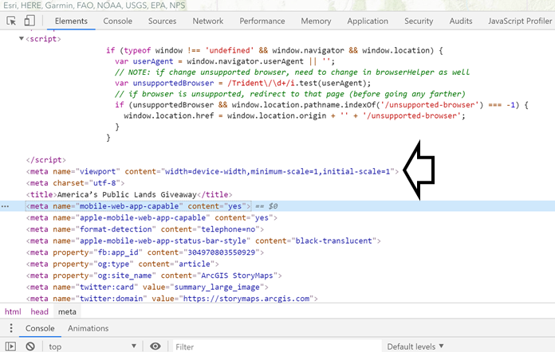
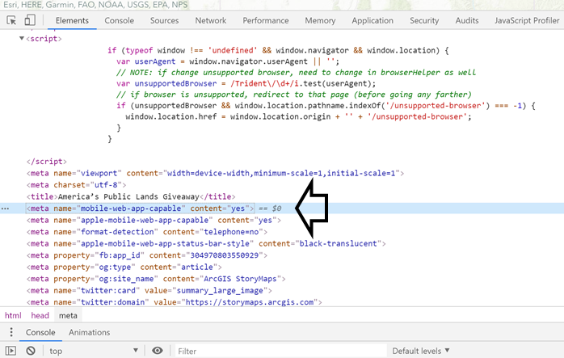
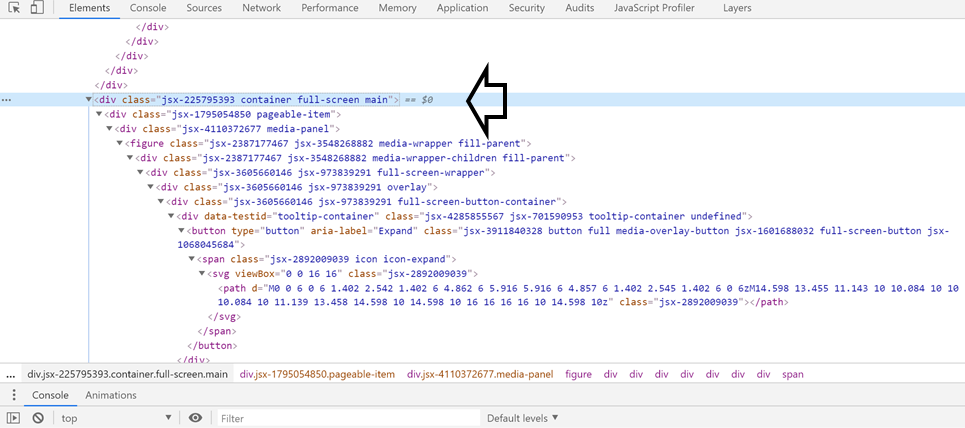

# essay

  
## Digital Geography for Natural Heritage Conservation Mobilization in the U.S. 

### :newspaper: Introduction
### A. Digital Geography 
Digital technology has long enabled scholars to explain phenomena related to almost all aspects of urban living: politics, social, culture, economy, and nature. The relationship between the digital technology and geography takes at least 3 forms:
- **produced through**, meaning that the digital technology is aimed at actualizing unorthodox understanding to produce geographic, politics, and spatial knowledges. Despite criticsm against its use, the engagement between the digital technology and geography has proven to be able to mobilize people power for social change;
- **produced by**, meaning that digital system served cities planning, management, governance, and research by integrating the urban big data, computational modelling, urban simulation, and interactions with diffent users and urban spaces;
- **geographies of digital**, meaning that the digital geographies are sets of technologies that go beyond an engagement with an interface, but with spatial big data. One of the examples is the  geotagged data retrieved from Twitter that can be used to explain sociospatial dynamics in particular area to public (James, Kitchin and Leszczynski 2018, 26-34).  

With this understanding, the storymap entitled **`America's Public Land Giveaway`** written by *Andre Miller* is selected for this essay. The storymap provides a good example of how the author carefully designed and selected the web features to provide public with understanding on the implications of government's unreformed land leasing system and regulation in the Western part of the U.S. and to mobilize supports from the U.S. public for land conservation. 

### B. Case Study 
The goal of the storymap is *to discuss the implications of the federal government and Trump administration's policy of leasing millions of acres of public lands for private oil and gas development with low and outdated rent price on conservation sites of natural heritage in the Western part of the U.S*. These natural heritage include Dinosaur National Monument and critical habitats of plant and animal species situated in 10 states: Arizona, California, Colorado, Idaho, Montana, New Mexico, Nevada, Oregon, Utah, and Wyoming. The issue revolves around the un-updated leasing system for oil and gas industries' operations in the West. The leasing system had not been renewed since a century ago. However, the leasing has already locked up millions of acres of public land in the West. The disadvantages resulted from this are the ineffective use of the land since limited amount of oil and gas produced from the current oil and gas industries, the decrease in annual tax return at only $ 1.50 per acre for taxpayers, and risks on the natural heritage conservation.  
**The major functions of the storymap** is to mobilize public supports for encouraging the congress to modernize the oil and gas leasing system. Through this, the land could be utilized for social, cultural, and environmental purposes which include public recreation and natural heritage conservation.   For this reason, the story map does not limit its audience to particular group, rather to the public audience. It is expected that the story could develop public awareness on the issue and mobilize them to encourage congress and the U.S. government to revise the land leasing system and land utilization in the West.  The storymap is the evidence of the power of digital geography which enables people to recognize the urban issue and observe how the unseen **`panopticon`** <href="https://www.theguardian.com/technology/2015/jul/23/panopticon-digital-surveillance-jeremy-bentham"> along with its machine exercised power in the U.S.(Foucault 2014, 660). 
The authors of the storymap are a non-profit organization for wildlife conservation, **`The Wilderness Society`** <https://www.wilderness.org/about-us> and a nonpartisan conservation and advocacy organization for the American West, **`Center for Western Priorities`** <https://westernpriorities.org/about/>. 
  

### :bar_chart: Systematic Architecture
In order to create, serve, and use web mapping, several different machines are required. The machines are often depicted in a diagram consisting of separate levels, or tiers of architecture. The figure below shows the **Web Client Application** label which extends into a little cloud labeled as **External Internet**. The line from this cloud continues to **Internal Network** label which then leads to **Web-server** and **Geospatial server**  below it. The line then branches to **File Server** and **Database server**. In the left, there is another computer drawing labeled as **Administrators** and **Internal Client Application**. 

  

The systematic architecture of the web map is explained as follows:
- **desktop workstations** are used by the web's administrators and internal client applications to prepare data, author maps, including administer the other machines.
- **database server** and **file server** act as what hold the GIS data and research data of the two organizations. The data might consist of spatial data in raster or vector formats.
- **geospatial server** used to host the web services in this project is that provided by ArcGIS <https://www.esri.com/en-us/arcgis/products/geoportal-server/overview>. Esri Geoportal Server is known as an open source product that since 1969, has enabled many organizations like the two nonprofit conservation organizations to manage and publish their geospatial data and resources for wide range of users.  

  

As can be seen from the footnote of the storymap in the above image, the web map was powered by the use of **`ArcGIS`** provided by ESRI geoportal server.

### :lock_with_ink_pen: Code Analysis
In order to investigate the codes employed by the web map, we inspected the web by right-clicking the web browser. As seen from the image below, we found the elements and codes of the web, the data flowed between the client and server, the major libraries with their functions, and whether the web supports responsive design. 
 
-  **`var _paq = _paq || []`** to help client to track any application that supports JavaScript like websites
-  **`svg viewBox="" class="" `** to scale the SVG element that we can set the coordinates as well as width and height
-  **`div class="esri-widget--button esri-widget esri-interactive" `** to match to other widget or small gadgets.
-  **`g transform='matrix()' `** to establish a new coordinate system inside the element where the transformations apply to. This means that the units specified for the element and its children might not follow the 1:1 pixel mapping, but are also distorted and scaled according to the transformation.
-  **`figure class ='' `** to display a piece of content, generally images with an optional caption.

### A. Data Flows Between Client and Server
The data flowed between the client and server come not only from the two nonprofit organizations' studies, but also information from other resources linked to the web. The data obtained from the web map include:
- the *Federal Onshore Oil and Gas Leasing Reform Act of 1987 100th Congress (1987-1988)* <https://www.congress.gov/bill/100th-congress/house-bill/2851>. It is used to support the author's argument that the leasing system on land for oil and gas drilling was outdated.   
-the spatial distribution of federal oil and gas leases comprising of those leased for minimum bid ($2 per acre), those leased noncompetitively (below $2 per acre), and leased under Trump administration  
- the spatial distribution of national parks, monuments, conservation areas, and wilderness areas, including the prioritized sage-grouse habitat, and mule deer migration corridor  
- the spatial conflict between the industries' exploration sites and the mule deer migration corridor  

### B. Libraries
Libraries in web map based javascript is used to provide various functions, whether the matter is related to events or effects or AJAX. All these libraries allow map creators or developers to perform a task. The major libraries used by the web map along with their functions include:
- .   The thematic or tiled layers however, include
Describe the basemap, the thematic layer and the interactive features if it has.
- list any web map element in use (e.g, scalar bar, north arrow, legend, etc.) if it has.  

### :bulb: Strengths & Weaknesses
#### strengths
The strengths of the web map include:
- it relies on responsive design which allows greater access and distribution of the Open Web Platform with cheap development. Since the web map has competencies in languages, inherent cross-platform and non-mobile support, the web map becomes a reliable resources for information to different types of groups or audience.
#### Weaknesses
Since the web map uses a responsive design with target to unlimited audience, the data dsiplayed in the web map reltively experiences a very slow processing and interaction speeds. This consequently requires a strong network connection by the users (Roth et al. 2018) 

### :thought_balloon: Discussion
- disucss anything else you feel worthy to share.
- reflect upon this project with some social theories, such as digital divide, power relationship, surveillance and/or resistance. 

### :flags: Credits/Acknowledgement
The credits for this project go to:
- United States Government for providing the data file through its open-sourced database.
- Mike Bostock whose website is inspirational for  further leaflet exercises and provides data file for this project.
- Carto DB for providing the basemap.
- Patiphan Phengpao whose stategy of developing live server for leaflet preview (besides Atom and Google Chrome) is highly contributive <https://www.youtube.com/watch?v=FHOcQdu1iFM>.  

### :link: References  
[1] Aviation consultant DWU:  <https://dwuconsulting.com/>  
